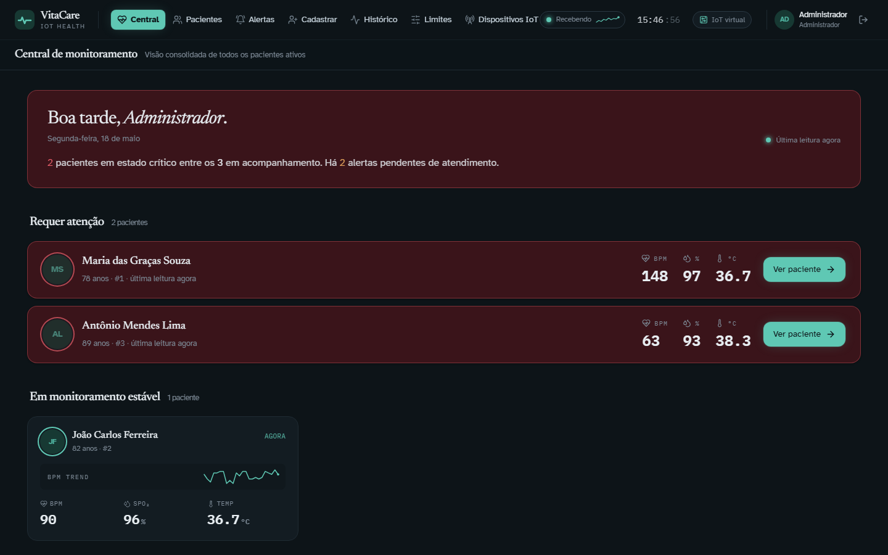
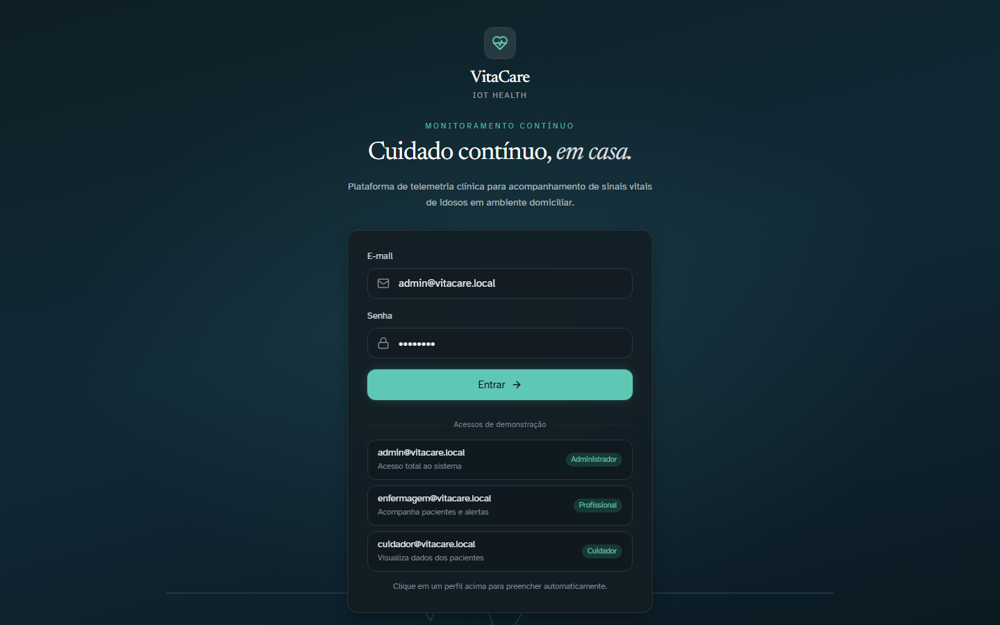
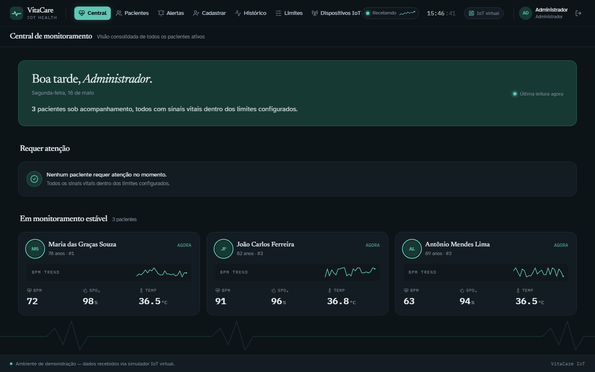
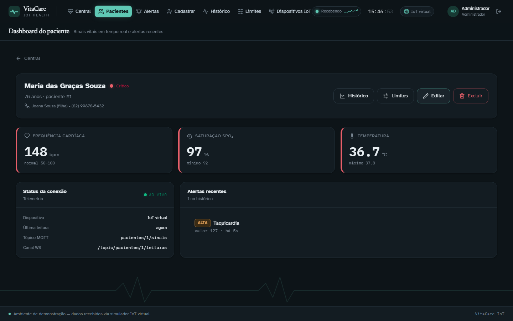
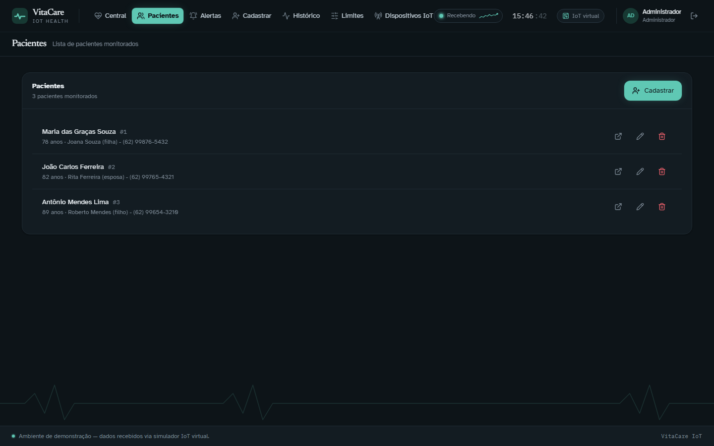
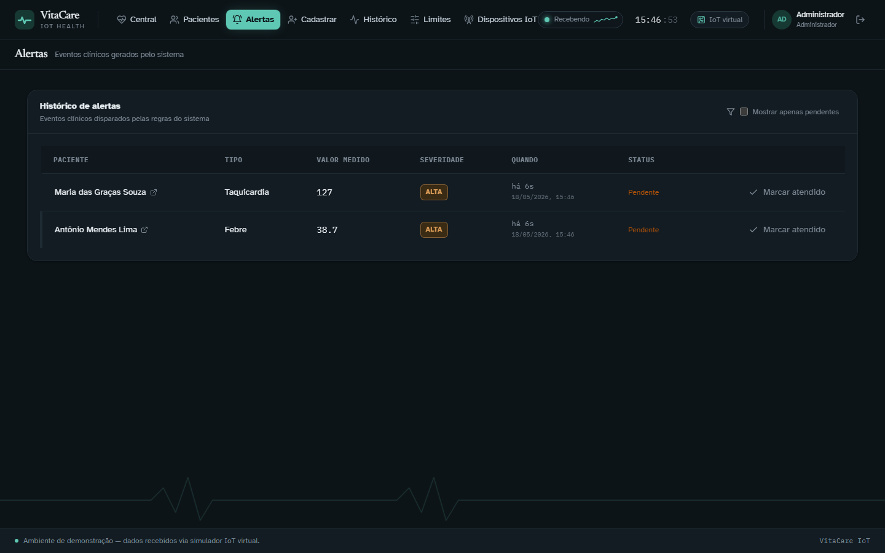
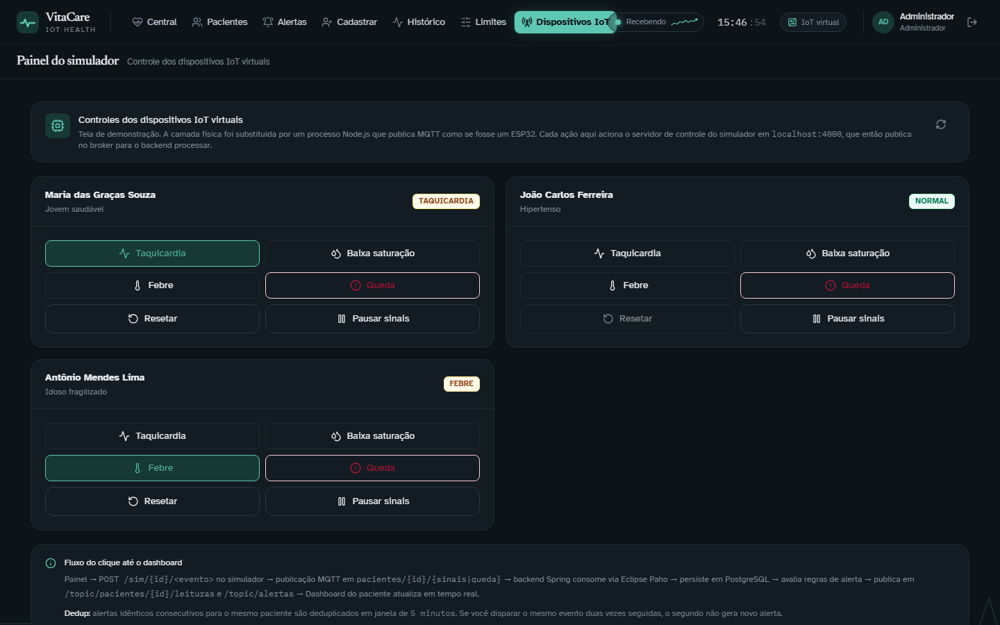

# VitaCare IoT

Aplicação web de monitoramento contínuo de sinais vitais de idosos em ambiente
domiciliar. Implementa o ciclo completo de uma arquitetura IoT — coleta,
transporte por broker MQTT, processamento, persistência, regras de alerta e
visualização em tempo real — com a camada de dispositivos representada por um
simulador de software.



> **Protótipo acadêmico** desenvolvido para a disciplina de Internet das Coisas.
> Os dados exibidos não vêm de sensores físicos e o sistema **não substitui**
> atendimento médico, exames clínicos ou serviços de emergência.

---

## Problema

Idosos vivendo sozinhos ou com supervisão parcial enfrentam risco aumentado de
eventos clínicos silenciosos (quedas, picos pressóricos, dessaturação) que
podem evoluir sem intervenção oportuna. Acompanhar esses sinais à distância
exige uma plataforma capaz de:

- coletar continuamente sinais vitais com latência baixa;
- aplicar regras automáticas e gerar alertas priorizados;
- entregar os eventos a cuidadores e equipe de saúde em tempo real;
- preservar histórico para análise posterior.

O VitaCare IoT modela esse cenário em ambiente controlado, demonstrando o fluxo
ponta a ponta entre dispositivo, broker, backend, banco e painel clínico.

---

## Arquitetura

Quatro camadas, cada uma com responsabilidade isolada, conversando por
contratos padronizados:

```
  ┌──────────────────────────────────────────────────────────────┐
  │ 1. DISPOSITIVOS (simulada)                                   │
  │    Simulador Node.js publica sinais e eventos via mqtt.js    │
  └────────────────────────┬─────────────────────────────────────┘
                           │ MQTT publish
                           ▼
  ┌──────────────────────────────────────────────────────────────┐
  │ 2. REDE                                                      │
  │    Broker MQTT Mosquitto distribui mensagens entre           │
  │    publicadores e assinantes                                 │
  └────────────────────────┬─────────────────────────────────────┘
                           │ MQTT subscribe
                           ▼
  ┌──────────────────────────────────────────────────────────────┐
  │ 3. PROCESSAMENTO                                             │
  │    Backend Spring Boot consome MQTT (Eclipse Paho), persiste │
  │    em PostgreSQL (JPA + Flyway), avalia regras de alerta e   │
  │    publica eventos em tempo real via WebSocket/STOMP         │
  └────────────────────────┬─────────────────────────────────────┘
                           │ REST + STOMP
                           ▼
  ┌──────────────────────────────────────────────────────────────┐
  │ 4. APLICAÇÃO                                                 │
  │    Frontend React (Vite + TS) exibe central de               │
  │    monitoramento, dashboard do paciente, alertas, histórico  │
  │    e painel de controle do simulador                         │
  └──────────────────────────────────────────────────────────────┘
```

Aprofundamento técnico em [`docs/ARQUITETURA.md`](docs/ARQUITETURA.md).

---

## Stack

| Camada | Tecnologia |
|---|---|
| Simulador IoT | Node.js 20+, `mqtt.js`, Express (servidor de controle) |
| Broker MQTT | Eclipse Mosquitto 2.0 |
| Backend | Java 17, Spring Boot 3.5 (Web, Data JPA, Security, WebSocket), Eclipse Paho MQTT, Flyway, JJWT |
| Banco de dados | PostgreSQL 16 |
| Frontend | React 18, TypeScript, Vite, Tailwind CSS, React Router 6, Axios, `@stomp/stompjs`, Recharts |
| Servidor web (frontend) | Nginx 1.27 (em produção/Docker), reverse proxy de `/api` e `/ws` |
| Build backend | Maven (wrapper incluído) |
| Containerização | Docker + Docker Compose |

---

## Estrutura do repositório

| Pasta / arquivo | Conteúdo |
|---|---|
| `backend/` | Aplicação Spring Boot — REST, consumo MQTT, regras de alerta, WebSocket STOMP, JWT. |
| `frontend/` | SPA React + Vite + TypeScript — central, dashboard, histórico, alertas, painel do simulador. |
| `simulator/` | Simulador Node.js que publica MQTT e expõe API HTTP de controle. |
| `docs/` | Documentação técnica complementar (arquitetura, roteiro de apresentação). |
| `docker-compose.yml` | Orquestração dos 5 serviços na rede `vitacare`. |
| `mosquitto.conf` | Configuração do broker para desenvolvimento local. |
| `.env.example` | Variáveis opcionais (senha do Postgres, segredo do JWT, perfil de simulação). |

---

## Telas da aplicação

As capturas abaixo foram feitas na aplicação rodando localmente via
`docker compose up --build`, autenticada como **admin** e com eventos clínicos
disparados pelo painel do simulador IoT.

### Acesso à plataforma



Login centralizado sobre gradiente sálvia → azul-petróleo. Três acessos de
demonstração (Administrador, Profissional, Cuidador) ficam disponíveis abaixo
do formulário e preenchem o campo automaticamente ao serem clicados.

### Central de monitoramento — todos os pacientes estáveis



Saudação personalizada e data clínica acima do resumo do plantão. Cada paciente
estável exibe um mini-gráfico da tendência de BPM (sparkline) e os três sinais
vitais principais. Fita ECG animada ancorada no rodapé reforça a sensação de
"monitor ligado".

### Central com pacientes em estado crítico


Quando o sistema detecta sinais fora dos limites configurados, a faixa de
status muda de tom (sálvia → âmbar → coral) e os pacientes em risco sobem para
a seção **Requer atenção**, com botão direto **Ver paciente** para o
profissional iniciar o atendimento.

### Dashboard do paciente em tempo real



Dashboard individual com sinais vitais ao vivo (atualizados via WebSocket/STOMP),
status clínico derivado dos limites, identificação do tópico MQTT consumido e
do canal WebSocket que entrega os dados ao navegador. O painel direito mostra
o histórico de alertas do paciente — neste caso, uma **Taquicardia** detectada
5 segundos antes.

### Lista de pacientes



Cadastro dos pacientes monitorados, com contato de emergência por linha. As
ações **Editar** e **Excluir** seguem a matriz de permissões: o cuidador só vê
o ícone de abrir dashboard, o profissional vê editar, e apenas o administrador
vê o botão de excluir.

### Histórico de alertas clínicos



Alertas gerados pelas regras do backend, com paciente, tipo, valor medido,
severidade, timestamp e status (pendente / atendido). A janela de
deduplicação de 5 minutos evita ruído quando uma violação clínica persiste.

### Painel do simulador IoT



Substitui a camada de hardware (ESP32 ou similar) por um processo Node.js que
publica em MQTT como se fosse um dispositivo real. Permite disparar
taquicardia, baixa saturação, febre e queda em cada paciente — o evento atravessa
broker → backend → banco → WebSocket → dashboard em poucos segundos.

---

## Como rodar com Docker (recomendado)

Sobe a stack completa — Postgres, Mosquitto, backend, frontend e simulador —
sem precisar instalar Java, Node ou Maven no host.

**Pré-requisitos:** Docker Desktop (Windows/macOS) ou Docker Engine + Compose
v2.20+ (Linux).

```bash
docker compose up --build -d        # primeira vez: ~2-4 min (Maven + npm)
docker compose ps                   # 5 containers devem aparecer 'healthy'
docker compose logs -f backend      # acompanhar inicialização do Spring
```

Acessos após subir:

| Serviço | URL |
|---|---|
| Frontend (SPA) | http://localhost:3000 |
| Backend REST (direto) | http://localhost:8080/api |
| Backend REST (via proxy nginx) | http://localhost:3000/api |
| WebSocket STOMP | `ws://localhost:3000/ws` ou `ws://localhost:8080/ws` |
| API de controle do simulador | http://localhost:4000/sim |
| PostgreSQL | `localhost:5432` (db `vitacare`, user `vitacare`, pwd `vitacare_dev`) |
| Mosquitto | `localhost:1883` (acesso anônimo, apenas dev local) |

Credenciais de login (criadas automaticamente na primeira execução):

| E-mail | Senha | Perfil |
|---|---|---|
| `admin@vitacare.local` | `admin123` | ADMIN |
| `enfermagem@vitacare.local` | `profissional123` | PROFISSIONAL |
| `cuidador@vitacare.local` | `cuidador123` | CUIDADOR |

Operações úteis:

```bash
docker compose down                 # para tudo, mantém o volume do Postgres
docker compose down -v              # para tudo e apaga o banco
docker compose up -d --build <svc>  # rebuilda e recria apenas um serviço
```

Sobrescritas opcionais via `.env` na raiz (copie de `.env.example`):
`POSTGRES_PASSWORD`, `JWT_SECRET`, `SIM_PATIENT_IDS`,
`SIM_SINAIS_INTERVAL_MS`, `SIM_STATUS_INTERVAL_MS`.

---

## Como rodar manualmente (sem Docker)

Útil para desenvolvimento com hot-reload do Vite e do `spring-boot:run`.

**Pré-requisitos:** Docker (para Postgres e Mosquitto), Java 17, Node.js 20+.

```bash
# 1. Infraestrutura (somente Postgres + Mosquitto via Docker)
docker compose up -d postgres mosquitto

# 2. Backend Spring Boot — terminal próprio
cd backend
./mvnw spring-boot:run

# 3. Simulador IoT — terminal próprio
cd simulator
npm install                          # primeira vez
npm start                            # CLI interativo: `queda 1`, `taquicardia 2`, etc.

# 4. Frontend React — terminal próprio
cd frontend
npm install                          # primeira vez
npm run dev                          # http://localhost:5173 (HMR ativo)
```

Quando o simulador roda **fora** do Docker, ele cai no fallback
`mqtt://localhost:1883` e mantém o CLI interativo (digitar comandos no
terminal). Dentro do Docker, `stdin` não é TTY e o CLI é desativado
automaticamente — controle apenas via HTTP.

---

## Endpoints REST

Base: `http://localhost:8080` (direto) ou `http://localhost:3000` (via nginx
proxy do frontend).

| Método | Endpoint | Acesso | Descrição |
|---|---|---|---|
| GET | `/api/health` | público | Health check |
| POST | `/api/auth/login` | público | Autentica e devolve JWT (8h) |
| GET | `/api/auth/me` | autenticado | Dados do usuário do token |
| GET | `/api/pacientes` | autenticado | Lista pacientes |
| GET | `/api/pacientes/{id}` | autenticado | Detalhe |
| POST | `/api/pacientes` | autenticado | Cadastra (cria limites padrão automaticamente) |
| PUT | `/api/pacientes/{id}` | autenticado | Atualiza |
| DELETE | `/api/pacientes/{id}` | **ADMIN** | Exclui |
| GET | `/api/pacientes/{id}/limites` | autenticado | Faixas clínicas do paciente |
| PUT | `/api/pacientes/{id}/limites` | autenticado | Atualiza limites |
| GET | `/api/pacientes/{id}/leituras?minutos=N` | autenticado | Histórico (N de 1 a 1440) |
| GET | `/api/alertas` | autenticado | Todos os alertas |
| GET | `/api/pacientes/{id}/alertas` | autenticado | Alertas de um paciente |
| PATCH | `/api/alertas/{id}/atendido` | autenticado | Marca atendido |

Limites clínicos padrão criados ao cadastrar paciente:

| Sinal | Mínimo | Máximo |
|---|---|---|
| Frequência cardíaca | 50 bpm | 100 bpm |
| Saturação SpO₂ | 92 % | — |
| Temperatura | — | 37,8 °C |

Alertas idênticos consecutivos para o mesmo paciente são deduplicados em janela
de 5 minutos para evitar ruído quando a violação persiste.

### API de controle do simulador

Servidor HTTP local, porta 4000. CORS aberto para o frontend dev.

| Método | Endpoint | Descrição |
|---|---|---|
| GET | `/sim/status` | Estado atual de cada paciente simulado |
| POST | `/sim/{id}/taquicardia` | Fixa o paciente em taquicardia (BPM ~140) |
| POST | `/sim/{id}/baixa-saturacao` | Fixa em saturação baixa (SpO₂ ~88) |
| POST | `/sim/{id}/febre` | Fixa em febre (temp ~38,7 °C) |
| POST | `/sim/{id}/queda` | Publica evento pontual de queda (body: `{intensidade}`) |
| POST | `/sim/{id}/reset` | Volta o paciente ao estado normal |
| POST | `/sim/{id}/pausar` | Para de publicar sinais do paciente |
| POST | `/sim/{id}/retomar` | Retoma a publicação |

---

## Tópicos MQTT e canais WebSocket

### MQTT (publicador: simulador; assinante: backend)

| Tópico | Payload JSON |
|---|---|
| `pacientes/{id}/sinais` | `{ "bpm": 78, "spo2": 97, "temp": 36.8, "ts": "2026-05-18T10:00:00Z" }` |
| `pacientes/{id}/queda`  | `{ "detectada": true, "intensidade": 2.7, "ts": "..." }` |
| `pacientes/{id}/status` | `{ "online": true, "ts": "..." }` |

### WebSocket / STOMP (publicador: backend; assinante: frontend)

Endpoint de conexão: `/ws` (STOMP nativo, sem SockJS).

| Tópico | Payload | Quando |
|---|---|---|
| `/topic/pacientes/{id}/leituras` | `LeituraEvent` | Cada nova leitura MQTT persistida |
| `/topic/pacientes/{id}/alertas` | `AlertaEvent` | Cada novo alerta do paciente |
| `/topic/alertas` | `AlertaEvent` | Feed global de alertas |
| `/topic/central` | `AlertaEvent` | Espelho do feed global, dedicado à Central |

---

## Fluxo de funcionamento

Sequência completa de uma queda crítica disparada pelo painel do simulador:

```
1. Operador clica "Queda" no Painel do Simulador (frontend)
       │
       ▼
2. Frontend → POST http://localhost:4000/sim/3/queda  {intensidade: 3.2}
       │
       ▼
3. Simulator chama PacienteVirtual.gerarQueda(...) e publica MQTT:
   tópico  : pacientes/3/queda
   payload : { "detectada": true, "intensidade": 3.2, "ts": "..." }
       │
       ▼
4. Mosquitto distribui aos assinantes
       │
       ▼
5. Backend (MqttListener) recebe → dispatch para MqttMessageProcessor
   → AvaliadorAlertas.registrarQueda(paciente=3, intensidade=3.2)
   → cria entidade Alerta no PostgreSQL (severidade CRITICA, pois ≥ 2.5)
       │
       ▼
6. RealtimePublisher publica em 3 canais STOMP:
   /topic/pacientes/3/alertas
   /topic/alertas
   /topic/central
       │
       ▼
7. Frontend (Dashboard do paciente 3) recebe o AlertaEvent
   → abre Modal de Emergência em tela cheia
   → lista de Alertas atualiza
   → Central atualiza contadores
```

O mesmo fluxo (sem o modal de emergência) vale para taquicardia, baixa
saturação e febre — só que o gatilho é uma leitura periódica anormal em vez de
um evento pontual.

---

## Como demonstrar

Roteiro completo (12–15 min) em
[`docs/ROTEIRO_APRESENTACAO.md`](docs/ROTEIRO_APRESENTACAO.md). Versão curta
para validação rápida:

1. `docker compose up -d` — aguardar todos os 5 containers `healthy`.
2. Abrir `http://localhost:3000` e logar com `admin@vitacare.local` / `admin123`.
3. **Central de monitoramento** — 3 pacientes aparecem, leituras ao vivo.
4. Abrir paciente **Maria das Graças (#1)**.
5. Em outro terminal:
   ```bash
   curl -X POST http://localhost:4000/sim/1/taquicardia
   ```
   Em ~5 s o BPM sobe para ~140, o card vira borda vermelha, um novo
   alerta `TAQUICARDIA ALTA` aparece em "Alertas recentes" — tudo via
   WebSocket, sem reload.
6. Voltar para a Central → clicar **Painel do simulador** → disparar
   **Queda** no paciente Antônio (#3). O Dashboard do paciente 3 abre o
   **Modal de Emergência** vermelho. Marcar atendido fecha o modal e atualiza
   a lista de alertas.

Em caso de produção real, dados de saúde seriam considerados sensíveis pela
LGPD e exigiriam consentimento explícito, criptografia em trânsito e em
repouso, e controle granular de acesso — pontos que este protótipo não cobre.
